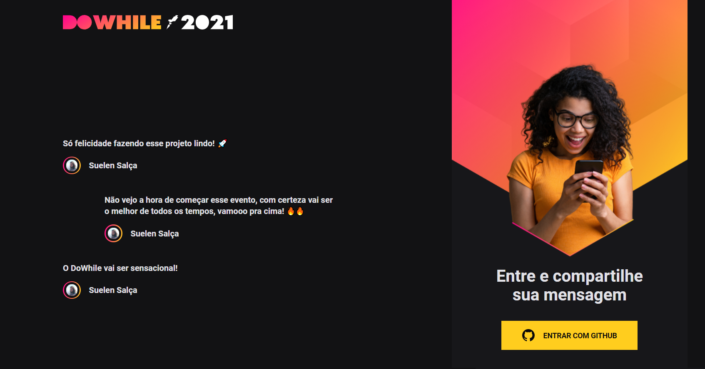

<h1>NLW/Heat Impulse</h1>

<h4>Projeto desenvolvido na missão impulse do Next Level Week Heat - Mission: Impulse.</h4>

A proposta do desafio era desenvolver uma aplicação onde as pessoas podem compartilhar suas expectativas sobre o DoWhile 2021. O projeto pode ser dividido em quatro partes.

<b>Stage 1</b> - Criamos o backend da aplicação utlizando NodeJS(node_heat). Nesse projeto iremos utilizamos Typescript, que auxilia no aumento da produtividade em desenvolvimento; o Prisma ORM, para trabalhar com banco de dados e Socket.IO para trabalhar comunicação em tempo real.

<b>Stage 2</b> - Criamos o front-end web da nossa aplicação utilizando ReactJS(web). Além disso, criamos nosso projeto utilizando o Vite, uma ferramenta extremamente performática, TypeScript e CSS modules.

<b>Stage 3</b> - Criamos o front-end mobile da nossa aplicação utilizando React Native(nlwapp). Além disso, criamos nosso projeto utilizando TypeScript e Expo que proporciona muita produtividade no desenvolvimento. Criamos toda interface da aplicação do zero, além de criar animações utilizando o Moti, AsyncStorage e integração em tempo real com socket.io.

<b>Stage 4</b> - Criamos um microserviço em Elixir responsável por gerar a nuvem de tags das mensagens enviadas na aplicação desenvolvida nos dias anteriores(elixir). Usamos conceitos de concorrência e paralelismo para a contagem de tags, e um processo que executa todos os dias para a geração dessa nuvem de tags. Com isso, utilizamos o Phoenix, Ecto, o módulo Task a lib Quantum e diversos conceitos do Elixir.

<h2 align="left">Screenshot Front-end Web</h2>

 

 

<h2 align="left"> Linguagens e Tecnologias</h2>

